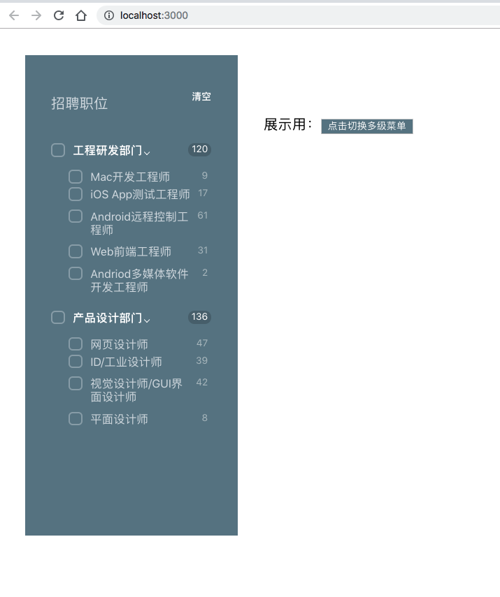
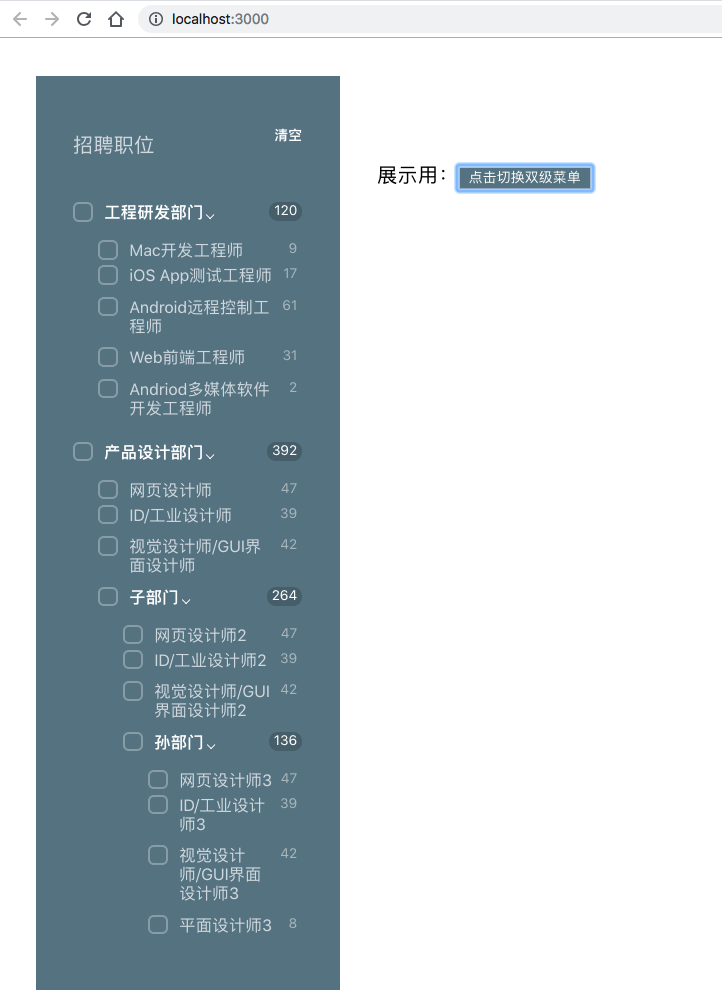

# React "递归"菜单

[Online demo](https://k1olwwnzrv.codesandbox.io/)

## How to run it locally
```
npm install

npm run start
```


## Time consumed

totally: 6 - 7 hours

1. 思考: 30 - 50 mins

2. UI: 40 - 60 mins

3. 逻辑: 120 mins

4. css: 60 mins

5. refactor: 45 mins


## TODOs:

1. 实现展开功能（未要求）
2. Unit tests
3. 某些逻辑可以放到selectors里
4. Component 可以更加细分, 所有的view都用 stateless component来做 （缺点：太多文件）
5. NestedMenuItem 也可以作为children传入NestMenuList， 这样逻辑可以复用，item可以任意改变
6. uncheck子菜单自动uncheck父菜单， 但是保留其他子菜单的状态 （子菜单更改父菜单逻辑， 可能需要在parent创建另外的state去管理父的状态， 因为现在逻辑是父菜单会更新子菜单，但是我们又需要在保留其他子菜单状态的同时用子菜单更新父菜单状态）

## How it looks:

> 双级菜单：



> 多级菜单


